# Diseño de Arquitectura - API Documentos Financieros Duppla

## Índice

1. [Diagramas C4](#diagramas-c4)
   - [Nivel 1: Contexto del Sistema](#nivel-1-contexto-del-sistema)
   - [Nivel 2: Contenedores](#nivel-2-contenedores)
   - [Nivel 3: Componentes](#nivel-3-componentes)
2. [Arquitectura de Capas](#arquitectura-de-capas)
3. [Diagramas de Flujo](#diagramas-de-flujo)
4. [State Machine](#state-machine)
5. [Modelo de Datos](#modelo-de-datos)
6. [Seguridad](#seguridad)

---

## Diagramas C4

### Nivel 1: Contexto del Sistema

Este diagrama muestra cómo el sistema interactúa con usuarios y sistemas externos.

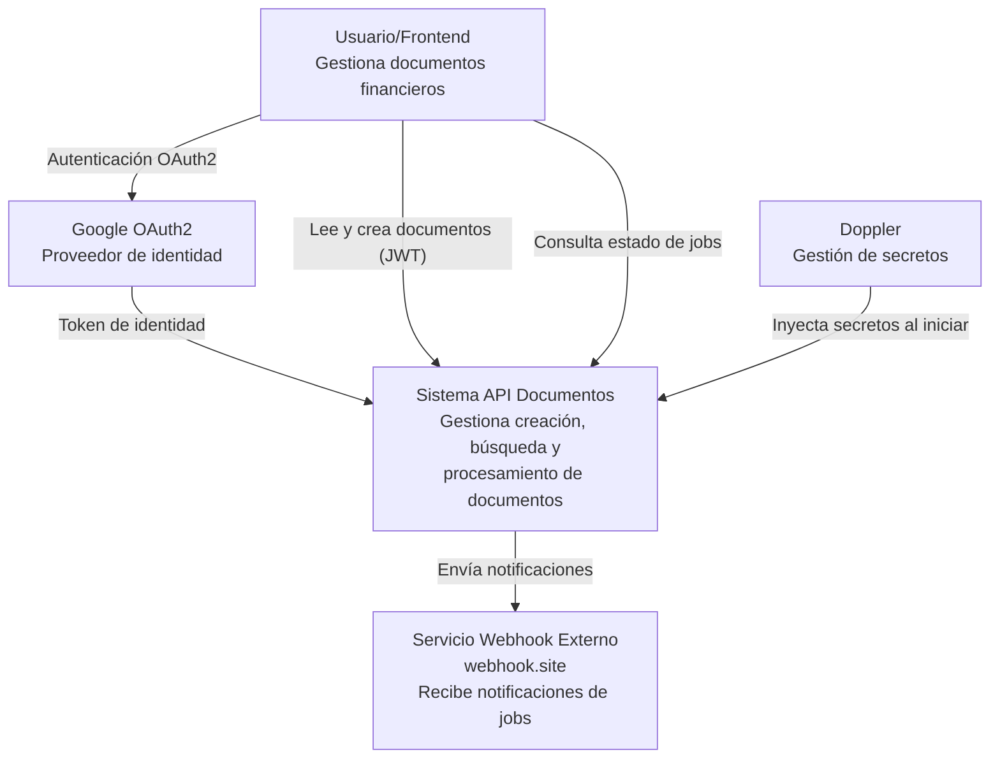
```mermaid
graph TB
    User["Usuario/Frontend<br/>Gestiona documentos financieros"]

    System["Sistema API Documentos<br/>Gestiona creación, búsqueda y<br/>procesamiento de documentos"]

    GoogleOAuth["Google OAuth2<br/>Proveedor de identidad"]

    WebhookService["Servicio Webhook Externo<br/>webhook.site<br/>Recibe notificaciones de jobs"]

    DopplerSecrets["Doppler<br/>Gestión de secretos"]

    User -->|"Autenticación OAuth2"| GoogleOAuth
    GoogleOAuth -->|"Token de identidad"| System
    User -->|"Lee y crea documentos (JWT)"| System
    User -->|"Consulta estado de jobs"| System
    System -->|"Envía notificaciones"| WebhookService
    DopplerSecrets -->|"Inyecta secretos al iniciar"| System
```

**Descripción:**
- **Usuario/Frontend**: Aplicación React que interactúa con la API mediante JWT
- **Sistema API Documentos**: Endpoints REST para CRUD, búsqueda con filtros, procesamiento batch asíncrono y gestión de usuarios
- **Google OAuth2**: Proveedor de identidad para autenticación de usuarios
- **Servicio Webhook Externo**: Recibe notificaciones cuando se completan trabajos de procesamiento batch
- **Doppler**: Gestiona e inyecta secretos (API keys, credenciales OAuth, JWT secret) en tiempo de arranque

---

### Nivel 2: Contenedores

Este diagrama muestra los contenedores principales del sistema y cómo se comunican.

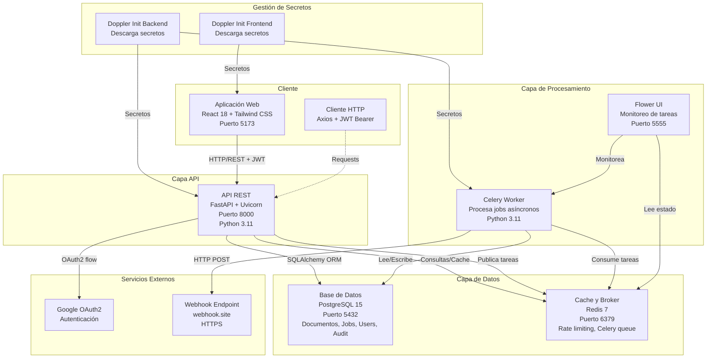
```mermaid
graph TB
    subgraph ClientLayer["Cliente"]
        WebApp["Aplicación Web<br/>React 18 + Tailwind CSS<br/>Puerto 5173"]
        APIClient["Cliente HTTP<br/>Axios + JWT Bearer"]
    end

    subgraph SecretsLayer["Gestión de Secretos"]
        DopplerBackend["Doppler Init Backend<br/>Descarga secretos"]
        DopplerFrontend["Doppler Init Frontend<br/>Descarga secretos"]
    end

    subgraph APILayer["Capa API"]
        FastAPI["API REST<br/>FastAPI + Uvicorn<br/>Puerto 8000<br/>Python 3.11"]
    end

    subgraph WorkerLayer["Capa de Procesamiento"]
        CeleryWorker["Celery Worker<br/>Procesa jobs asíncronos<br/>Python 3.11"]
        Flower["Flower UI<br/>Monitoreo de tareas<br/>Puerto 5555"]
    end

    subgraph DataLayer["Capa de Datos"]
        PostgreSQL["Base de Datos<br/>PostgreSQL 15<br/>Puerto 5432<br/>Documentos, Jobs, Users, Audit"]
        Redis["Cache y Broker<br/>Redis 7<br/>Puerto 6379<br/>Rate limiting, Celery queue"]
    end

    subgraph ExternalLayer["Servicios Externos"]
        GoogleAuth["Google OAuth2<br/>Autenticación"]
        WebhookEndpoint["Webhook Endpoint<br/>webhook.site<br/>HTTPS"]
    end

    DopplerBackend -->|"Secretos"| FastAPI
    DopplerBackend -->|"Secretos"| CeleryWorker
    DopplerFrontend -->|"Secretos"| WebApp

    WebApp -->|"HTTP/REST + JWT"| FastAPI
    APIClient -.->|"Requests"| FastAPI

    FastAPI -->|"SQLAlchemy ORM"| PostgreSQL
    FastAPI -->|"Consultas/Cache"| Redis
    FastAPI -->|"Publica tareas"| Redis
    FastAPI -->|"OAuth2 flow"| GoogleAuth

    CeleryWorker -->|"Consume tareas"| Redis
    CeleryWorker -->|"Lee/Escribe"| PostgreSQL
    CeleryWorker -->|"HTTP POST"| WebhookEndpoint

    Flower -->|"Monitorea"| CeleryWorker
    Flower -->|"Lee estado"| Redis
```

**Tecnologías por Contenedor:**

| Contenedor | Tecnología | Propósito |
|------------|-----------|-----------|
| Frontend | React 18 + Tailwind CSS + Vite | SPA con dark mode, RBAC visual |
| API REST | FastAPI + Uvicorn | Endpoints HTTP, validación, autenticación JWT |
| Celery Worker | Celery + Python | Procesamiento asíncrono de lotes con auto-evaluación |
| PostgreSQL | PostgreSQL 15 | Persistencia de documentos, jobs, usuarios y auditoría |
| Redis | Redis 7 | Cache, rate limiting (sliding window) y cola de mensajes |
| Flower | Flower | Monitoreo visual de workers |
| Doppler Init | Alpine + curl | Descarga de secretos al arrancar los contenedores |

---

### Nivel 3: Componentes

Este diagrama muestra la arquitectura interna del contenedor API REST usando Clean Architecture.

```mermaid
graph TB
    subgraph PresentationLayer["Presentation Layer"]
        Routes["API Routes<br/>documents, batch, jobs, auth, admin"]
        Middleware["Middleware<br/>JWT Auth, RBAC, Rate Limiter, Error Handler"]
        Dependencies["Dependencies<br/>Dependency Injection"]
    end

    subgraph ApplicationLayer["Application Layer"]
        CreateUC["CreateDocument"]
        SearchUC["SearchDocuments"]
        UpdateUC["UpdateStatus"]
        UpdateDocUC["UpdateDocument"]
        BatchUC["ProcessBatch"]
        GetJobUC["GetJobStatus"]
        ListJobsUC["ListJobs"]
        AuthUC["AuthService"]
        DTOs["DTOs<br/>Request/Response objects"]
    end

    subgraph DomainLayer["Domain Layer"]
        DocumentoEntity["Document Entity"]
        UserEntity["User Entity"]
        JobEntity["Job Entity"]
        StatusVO["DocumentStatus / JobStatus"]
        UserRoleVO["UserRole / UserStatus"]
        StateMachine["State Machine<br/>Validación de transiciones"]
        Exceptions["Domain Exceptions"]
    end

    subgraph InfrastructureLayer["Infrastructure Layer"]
        DocumentoRepo["Document Repository"]
        JobRepo["Job Repository"]
        UserRepo["User Repository"]
        AuditRepo["Audit Repository"]
        DatabaseConn["Database Connection<br/>SQLAlchemy Session"]
        RedisClient["Redis Client<br/>Cache + Rate Limit"]
        NotifDispatcher["Notification Dispatcher"]
        NotifChannels["Notification Channels<br/>HTTP Webhook"]
        CeleryTasks["Celery Tasks<br/>Procesar batch"]
    end

    subgraph ExternalSystems["Sistemas Externos"]
        DB[("PostgreSQL")]
        Cache[("Redis")]
        QueueBroker["Redis Queue"]
        WebhookAPI["Webhook API"]
        GoogleAPI["Google OAuth2"]
    end

    Routes --> Middleware
    Middleware --> Dependencies
    Dependencies --> CreateUC
    Dependencies --> SearchUC
    Dependencies --> UpdateUC
    Dependencies --> UpdateDocUC
    Dependencies --> BatchUC
    Dependencies --> GetJobUC
    Dependencies --> ListJobsUC
    Dependencies --> AuthUC

    CreateUC --> DocumentoEntity
    SearchUC --> DocumentoEntity
    UpdateUC --> StateMachine
    UpdateDocUC --> DocumentoEntity
    BatchUC --> JobEntity
    GetJobUC --> JobEntity
    AuthUC --> UserEntity

    CreateUC --> DTOs
    SearchUC --> DTOs

    DocumentoEntity --> StatusVO
    UserEntity --> UserRoleVO
    UpdateUC --> Exceptions
    StateMachine --> StatusVO

    CreateUC --> DocumentoRepo
    SearchUC --> DocumentoRepo
    UpdateUC --> DocumentoRepo
    UpdateDocUC --> DocumentoRepo
    BatchUC --> JobRepo
    BatchUC --> CeleryTasks
    GetJobUC --> JobRepo
    ListJobsUC --> JobRepo
    AuthUC --> UserRepo

    DocumentoRepo --> DatabaseConn
    JobRepo --> DatabaseConn
    UserRepo --> DatabaseConn
    AuditRepo --> DatabaseConn
    Middleware --> RedisClient
    CeleryTasks --> NotifDispatcher
    NotifDispatcher --> NotifChannels

    DatabaseConn --> DB
    RedisClient --> Cache
    CeleryTasks --> QueueBroker
    NotifChannels --> WebhookAPI
    AuthUC --> GoogleAPI
```

**Responsabilidades por Capa:**

#### 1. Presentation Layer (API)
- **Routes**: Define endpoints HTTP para documentos, batch, jobs, autenticación y administración
- **Middleware**: Autenticación JWT, RBAC (role-based access), rate limiting, manejo de errores
- **Dependencies**: Inyección de dependencias mediante FastAPI `Depends`

#### 2. Application Layer (Casos de Uso)
- **CreateDocument**: Valida datos de negocio y crea documento con audit log
- **SearchDocuments**: Aplica filtros y paginación
- **UpdateStatus**: Valida transiciones de estado con la state machine
- **UpdateDocument**: Actualiza campos (solo en estado DRAFT) con audit log
- **ProcessBatch**: Dispara procesamiento asíncrono vía Celery
- **GetJobStatus / ListJobs**: Consulta estado de jobs
- **AuthService**: OAuth2 con Google, emisión/validación de JWT, gestión de usuarios

#### 3. Domain Layer (Lógica de Negocio)
- **Entities**: Document, Job, User (objetos de dominio)
- **Value Objects**: DocumentStatus, JobStatus, UserRole, UserStatus
- **State Machine**: Valida transiciones DRAFT -> PENDING -> APPROVED/REJECTED, REJECTED -> DRAFT
- **Exceptions**: Errores de dominio personalizados

#### 4. Infrastructure Layer (Detalles Técnicos)
- **Repositories**: Document, Job, User, Audit — abstracción de acceso a datos
- **Database Connection**: Gestión de sesiones SQLAlchemy
- **Redis Client**: Cache de API keys y rate limiting (sliding window)
- **Notification Dispatcher**: Envía eventos a canales registrados (Strategy Pattern)
- **Celery Tasks**: Workers para procesamiento asíncrono con auto-evaluación

---

## Arquitectura de Capas

### Diagrama de Clean Architecture

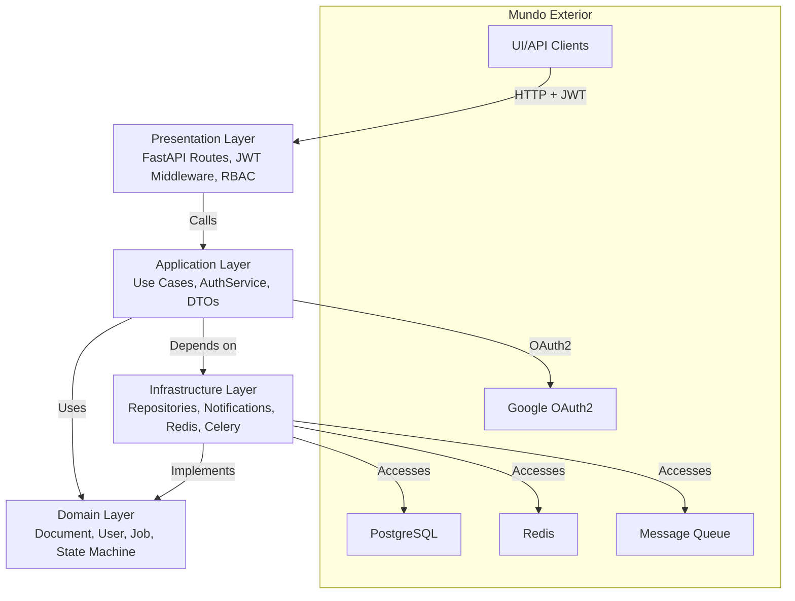
```mermaid
graph TD
    subgraph External["Mundo Exterior"]
        UI["UI/API Clients"]
        DB["PostgreSQL"]
        Cache["Redis"]
        Queue["Message Queue"]
        Google["Google OAuth2"]
    end

    subgraph Presentation["Presentation Layer<br/>FastAPI Routes, JWT Middleware, RBAC"]
    end

    subgraph Application["Application Layer<br/>Use Cases, AuthService, DTOs"]
    end

    subgraph Domain["Domain Layer<br/>Document, User, Job, State Machine"]
    end

    subgraph Infrastructure["Infrastructure Layer<br/>Repositories, Notifications, Redis, Celery"]
    end

    UI -->|"HTTP + JWT"| Presentation
    Presentation -->|"Calls"| Application
    Application -->|"Uses"| Domain
    Application -->|"Depends on"| Infrastructure
    Infrastructure -->|"Implements"| Domain
    Infrastructure -->|"Accesses"| DB
    Infrastructure -->|"Accesses"| Cache
    Infrastructure -->|"Accesses"| Queue
    Application -->|"OAuth2"| Google
```

### Flujo de Dependencias

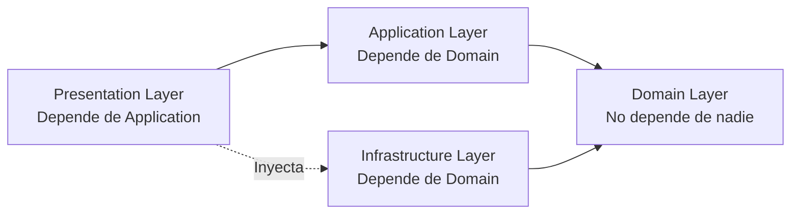
```mermaid
graph LR
    Domain["Domain Layer<br/>No depende de nadie"]
    Application["Application Layer<br/>Depende de Domain"]
    Infrastructure["Infrastructure Layer<br/>Depende de Domain"]
    Presentation["Presentation Layer<br/>Depende de Application"]

    Presentation --> Application
    Application --> Domain
    Infrastructure --> Domain
    Presentation -.->|"Inyecta"| Infrastructure
```

**Principio de Inversión de Dependencias:**
- Las capas externas dependen de las internas
- El dominio no conoce detalles de infraestructura
- Los repositories son interfaces en Domain, implementadas en Infrastructure

---

## Diagramas de Flujo

### Flujo 1: Autenticación con Google OAuth2

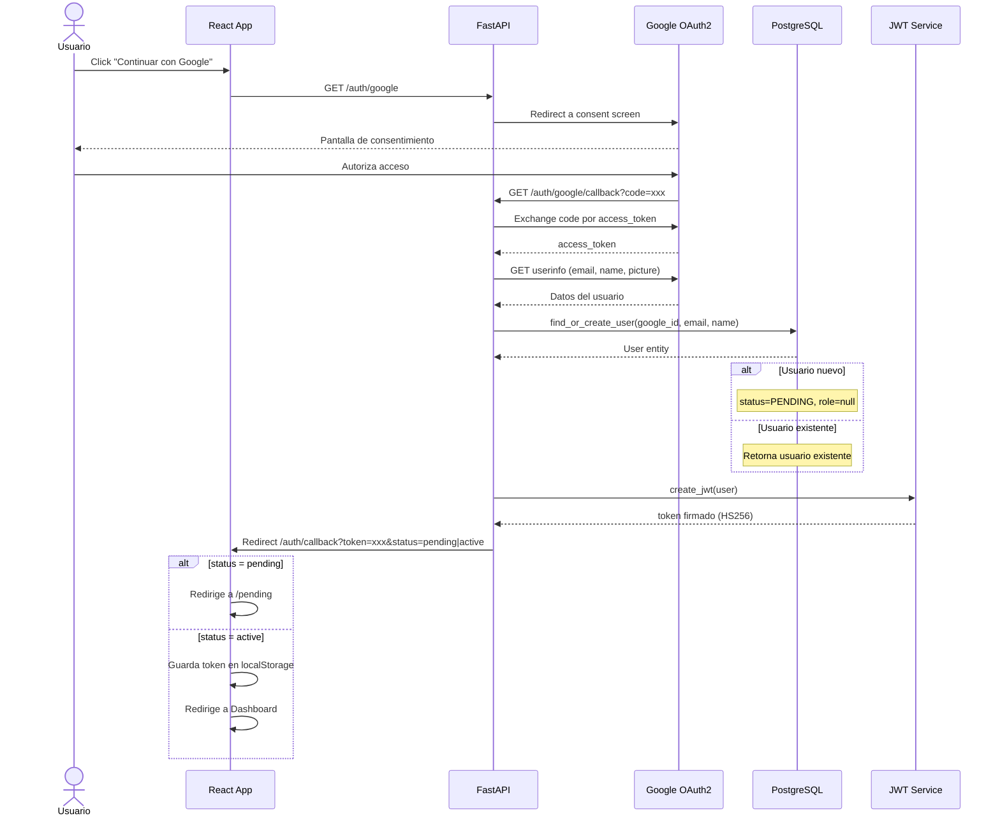
```mermaid
sequenceDiagram
    actor User as Usuario
    participant Frontend as React App
    participant API as FastAPI
    participant Google as Google OAuth2
    participant DB as PostgreSQL
    participant JWT as JWT Service

    User->>Frontend: Click "Continuar con Google"
    Frontend->>API: GET /auth/google
    API->>Google: Redirect a consent screen
    Google-->>User: Pantalla de consentimiento

    User->>Google: Autoriza acceso
    Google->>API: GET /auth/google/callback?code=xxx

    API->>Google: Exchange code por access_token
    Google-->>API: access_token

    API->>Google: GET userinfo (email, name, picture)
    Google-->>API: Datos del usuario

    API->>DB: find_or_create_user(google_id, email, name)
    DB-->>API: User entity

    alt Usuario nuevo
        Note over DB: status=PENDING, role=null
    else Usuario existente
        Note over DB: Retorna usuario existente
    end

    API->>JWT: create_jwt(user)
    JWT-->>API: token firmado (HS256)

    API->>Frontend: Redirect /auth/callback?token=xxx&status=pending|active

    alt status = pending
        Frontend->>Frontend: Redirige a /pending
    else status = active
        Frontend->>Frontend: Guarda token en localStorage
        Frontend->>Frontend: Redirige a Dashboard
    end
```

---

### Flujo 2: Crear Documento

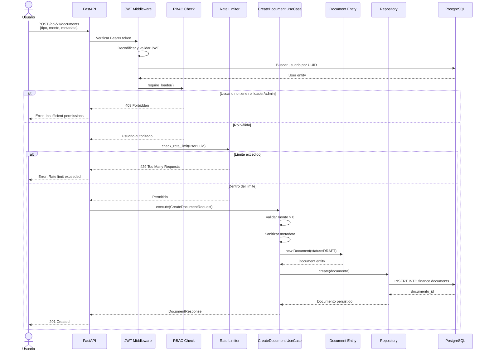
```mermaid
sequenceDiagram
    actor User as Usuario
    participant API as FastAPI
    participant JWT as JWT Middleware
    participant RBAC as RBAC Check
    participant RL as Rate Limiter
    participant UC as CreateDocument UseCase
    participant Domain as Document Entity
    participant Repo as Repository
    participant DB as PostgreSQL

    User->>API: POST /api/v1/documents<br/>{tipo, monto, metadata}
    API->>JWT: Verificar Bearer token
    JWT->>JWT: Decodificar y validar JWT
    JWT->>DB: Buscar usuario por UUID
    DB-->>JWT: User entity

    JWT->>RBAC: require_loader()
    alt Usuario no tiene rol loader/admin
        RBAC-->>API: 403 Forbidden
        API-->>User: Error: Insufficient permissions
    else Rol válido
        RBAC-->>API: Usuario autorizado

        JWT->>RL: check_rate_limit(user:uuid)
        alt Límite excedido
            RL-->>API: 429 Too Many Requests
            API-->>User: Error: Rate limit exceeded
        else Dentro del límite
            RL-->>API: Permitido

            API->>UC: execute(CreateDocumentRequest)
            UC->>UC: Validar monto > 0
            UC->>UC: Sanitizar metadata

            UC->>Domain: new Document(status=DRAFT)
            Domain-->>UC: Document entity

            UC->>Repo: create(documento)
            Repo->>DB: INSERT INTO finance.documents
            DB-->>Repo: documento_id
            Repo-->>UC: Documento persistido

            UC-->>API: DocumentResponse
            API-->>User: 201 Created
        end
    end
```

---

### Flujo 3: Actualizar Estado de Documento

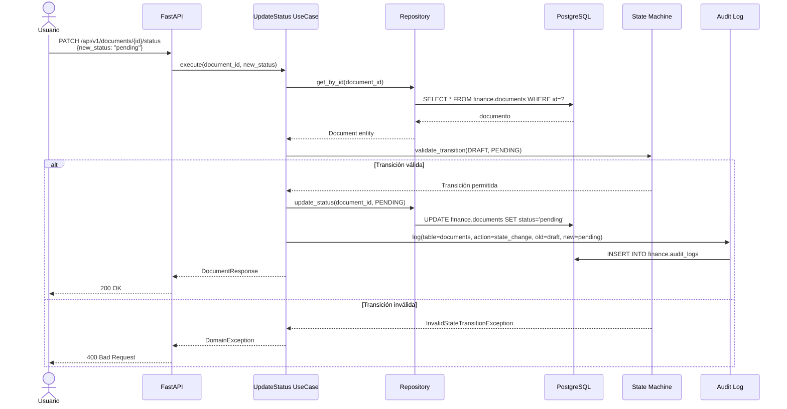
```mermaid
sequenceDiagram
    actor User as Usuario
    participant API as FastAPI
    participant UC as UpdateStatus UseCase
    participant Repo as Repository
    participant DB as PostgreSQL
    participant SM as State Machine
    participant Audit as Audit Log

    User->>API: PATCH /api/v1/documents/{id}/status<br/>{new_status: "pending"}

    API->>UC: execute(document_id, new_status)
    UC->>Repo: get_by_id(document_id)
    Repo->>DB: SELECT * FROM finance.documents WHERE id=?
    DB-->>Repo: documento
    Repo-->>UC: Document entity

    UC->>SM: validate_transition(DRAFT, PENDING)

    alt Transición válida
        SM-->>UC: Transición permitida

        UC->>Repo: update_status(document_id, PENDING)
        Repo->>DB: UPDATE finance.documents SET status='pending'

        UC->>Audit: log(table=documents, action=state_change, old=draft, new=pending)
        Audit->>DB: INSERT INTO finance.audit_logs

        UC-->>API: DocumentResponse
        API-->>User: 200 OK
    else Transición inválida
        SM-->>UC: InvalidStateTransitionException
        UC-->>API: DomainException
        API-->>User: 400 Bad Request
    end
```

---

### Flujo 4: Procesamiento Batch Asíncrono

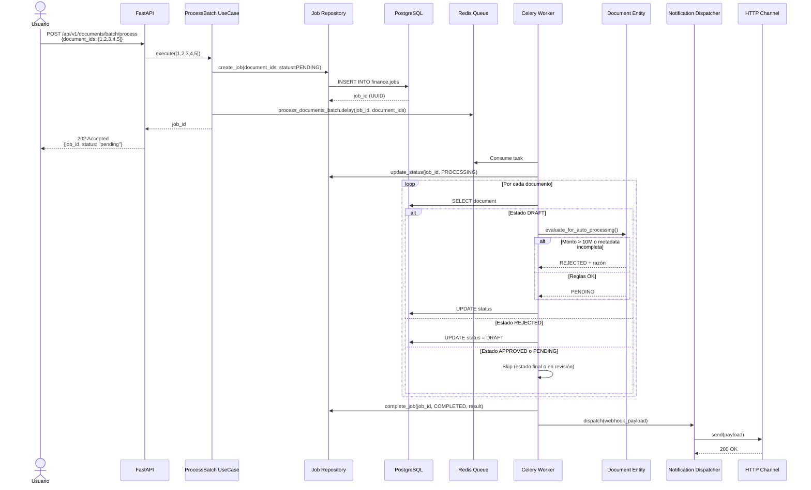
```mermaid
sequenceDiagram
    actor User as Usuario
    participant API as FastAPI
    participant UC as ProcessBatch UseCase
    participant JobRepo as Job Repository
    participant DB as PostgreSQL
    participant Redis as Redis Queue
    participant Worker as Celery Worker
    participant Domain as Document Entity
    participant Dispatcher as Notification Dispatcher
    participant Webhook as HTTP Channel

    User->>API: POST /api/v1/documents/batch/process<br/>{document_ids: [1,2,3,4,5]}

    API->>UC: execute([1,2,3,4,5])

    UC->>JobRepo: create_job(document_ids, status=PENDING)
    JobRepo->>DB: INSERT INTO finance.jobs
    DB-->>JobRepo: job_id (UUID)

    UC->>Redis: process_documents_batch.delay(job_id, document_ids)

    UC-->>API: job_id
    API-->>User: 202 Accepted<br/>{job_id, status: "pending"}

    Worker->>Redis: Consume task
    Worker->>JobRepo: update_status(job_id, PROCESSING)

    loop Por cada documento
        Worker->>DB: SELECT document
        alt Estado DRAFT
            Worker->>Domain: evaluate_for_auto_processing()
            alt Monto > 10M o metadata incompleta
                Domain-->>Worker: REJECTED + razón
            else Reglas OK
                Domain-->>Worker: PENDING
            end
            Worker->>DB: UPDATE status
        else Estado REJECTED
            Worker->>DB: UPDATE status = DRAFT
        else Estado APPROVED o PENDING
            Worker->>Worker: Skip (estado final o en revisión)
        end
    end

    Worker->>JobRepo: complete_job(job_id, COMPLETED, result)

    Worker->>Dispatcher: dispatch(webhook_payload)
    Dispatcher->>Webhook: send(payload)
    Webhook-->>Dispatcher: 200 OK
```

---

### Flujo 5: Búsqueda con Filtros y Paginación

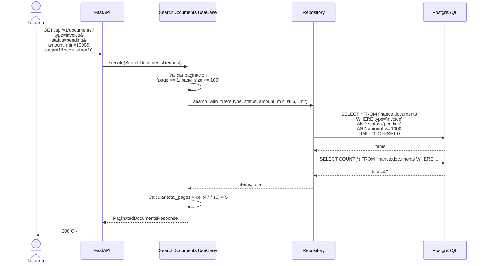
```mermaid
sequenceDiagram
    actor User as Usuario
    participant API as FastAPI
    participant UC as SearchDocuments UseCase
    participant Repo as Repository
    participant DB as PostgreSQL

    User->>API: GET /api/v1/documents?<br/>type=invoice&<br/>status=pending&<br/>amount_min=1000&<br/>page=1&page_size=10

    API->>UC: execute(SearchDocumentsRequest)

    UC->>UC: Validar paginación<br/>(page >= 1, page_size <= 100)

    UC->>Repo: search_with_filters(type, status, amount_min, skip, limit)

    Repo->>DB: SELECT * FROM finance.documents<br/>WHERE type='invoice'<br/>AND status='pending'<br/>AND amount >= 1000<br/>LIMIT 10 OFFSET 0
    DB-->>Repo: items

    Repo->>DB: SELECT COUNT(*) FROM finance.documents WHERE ...
    DB-->>Repo: total=47

    Repo-->>UC: items, total

    UC->>UC: Calcular total_pages = ceil(47 / 10) = 5

    UC-->>API: PaginatedDocumentsResponse
    API-->>User: 200 OK
```

---

## State Machine

### Diagrama de Estados del Documento

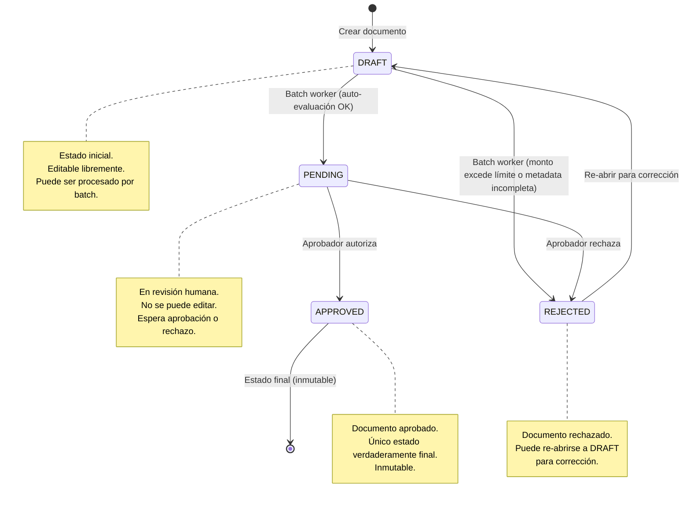
```mermaid
stateDiagram-v2
    [*] --> DRAFT: Crear documento

    DRAFT --> PENDING: Batch worker (auto-evaluación OK)
    DRAFT --> REJECTED: Batch worker (monto excede límite o metadata incompleta)

    PENDING --> APPROVED: Aprobador autoriza
    PENDING --> REJECTED: Aprobador rechaza

    REJECTED --> DRAFT: Re-abrir para corrección

    APPROVED --> [*]: Estado final (inmutable)

    note right of DRAFT
        Estado inicial.
        Editable libremente.
        Puede ser procesado por batch.
    end note

    note right of PENDING
        En revisión humana.
        No se puede editar.
        Espera aprobación o rechazo.
    end note

    note right of APPROVED
        Documento aprobado.
        Único estado verdaderamente final.
        Inmutable.
    end note

    note right of REJECTED
        Documento rechazado.
        Puede re-abrirse a DRAFT
        para corrección.
    end note
```

### Matriz de Transiciones Válidas

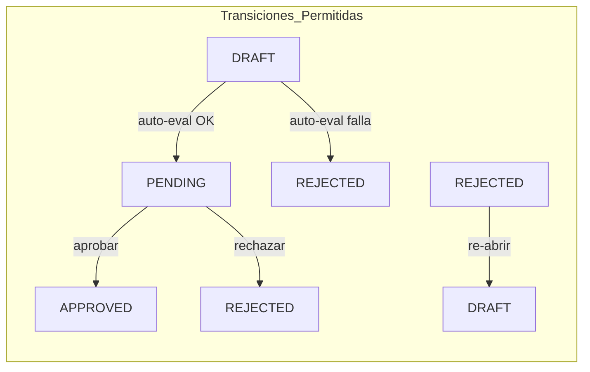
```mermaid
graph LR
    subgraph Transiciones_Permitidas
        B["DRAFT"] -->|"auto-eval OK"| P["PENDING"]
        B -->|"auto-eval falla"| R["REJECTED"]
        P -->|"aprobar"| A["APPROVED"]
        P -->|"rechazar"| R2["REJECTED"]
        R3["REJECTED"] -->|"re-abrir"| B2["DRAFT"]
    end
```

| Desde | Hacia | Disparador |
|-------|-------|------------|
| DRAFT | PENDING | Batch worker: documento cumple reglas de auto-procesamiento |
| DRAFT | REJECTED | Batch worker: monto > 10M o metadata incompleta |
| PENDING | APPROVED | Aprobador manual (rol approver/admin) |
| PENDING | REJECTED | Aprobador manual (rol approver/admin) |
| REJECTED | DRAFT | Re-apertura para corrección y re-procesamiento |
| APPROVED | --- | Estado final, no hay transiciones salientes |

---

## Modelo de Datos

### Diagrama Entidad-Relación

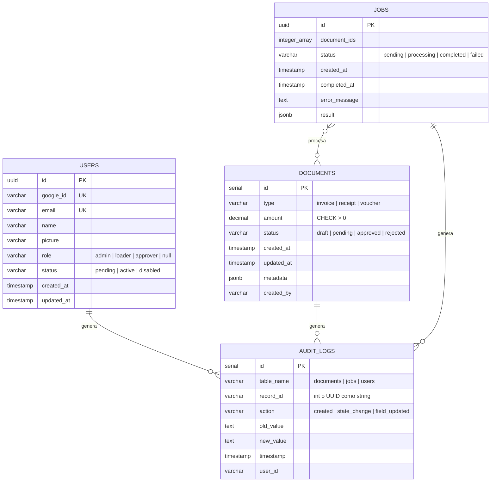
```mermaid
erDiagram
    USERS ||--o{ AUDIT_LOGS : "genera"
    DOCUMENTS ||--o{ AUDIT_LOGS : "genera"
    JOBS ||--o{ AUDIT_LOGS : "genera"
    JOBS }o--o{ DOCUMENTS : "procesa"

    USERS {
        uuid id PK
        varchar google_id UK
        varchar email UK
        varchar name
        varchar picture
        varchar role "admin | loader | approver | null"
        varchar status "pending | active | disabled"
        timestamp created_at
        timestamp updated_at
    }

    DOCUMENTS {
        serial id PK
        varchar type "invoice | receipt | voucher"
        decimal amount "CHECK > 0"
        varchar status "draft | pending | approved | rejected"
        timestamp created_at
        timestamp updated_at
        jsonb metadata
        varchar created_by
    }

    JOBS {
        uuid id PK
        integer_array document_ids
        varchar status "pending | processing | completed | failed"
        timestamp created_at
        timestamp completed_at
        text error_message
        jsonb result
    }

    AUDIT_LOGS {
        serial id PK
        varchar table_name "documents | jobs | users"
        varchar record_id "int o UUID como string"
        varchar action "created | state_change | field_updated"
        text old_value
        text new_value
        timestamp timestamp
        varchar user_id
    }
```

**Notas del modelo:**
- Todas las tablas viven en el schema `finance`
- `AUDIT_LOGS` es genérico: `(table_name, record_id)` permite auditar cualquier tabla sin FK directo
- `USERS.role` es null mientras el usuario está pendiente de aprobación
- Existen triggers de PostgreSQL que generan audit logs automáticamente ante cambios directos en BD

---

## Seguridad

### Capas de Seguridad

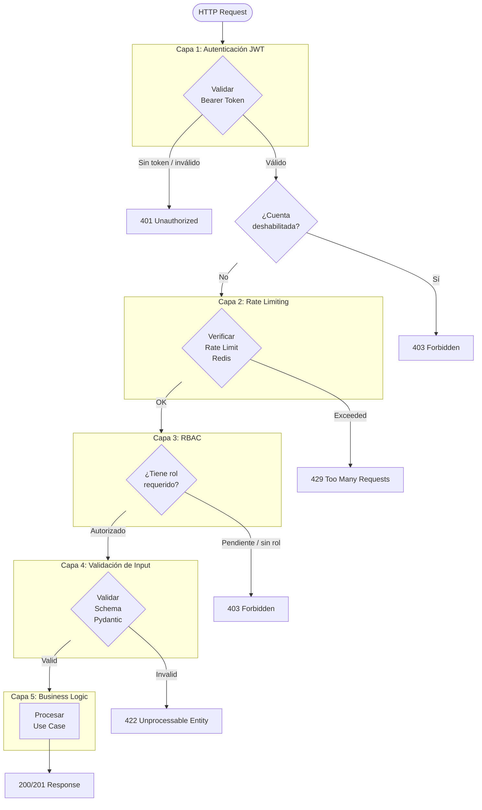
```mermaid
flowchart TB
    Request(["HTTP Request"]) --> Layer1

    subgraph Layer1["Capa 1: Autenticación JWT"]
        CheckJWT{"Validar<br/>Bearer Token"}
    end

    CheckJWT -->|"Sin token / inválido"| Reject1["401 Unauthorized"]
    CheckJWT -->|"Válido"| CheckDisabled

    CheckDisabled{"¿Cuenta<br/>deshabilitada?"}
    CheckDisabled -->|"Sí"| Reject1b["403 Forbidden"]
    CheckDisabled -->|"No"| Layer2

    subgraph Layer2["Capa 2: Rate Limiting"]
        CheckRate{"Verificar<br/>Rate Limit<br/>Redis"}
    end

    CheckRate -->|"Exceeded"| Reject2["429 Too Many Requests"]
    CheckRate -->|"OK"| Layer3

    subgraph Layer3["Capa 3: RBAC"]
        CheckRole{"¿Tiene rol<br/>requerido?"}
    end

    CheckRole -->|"Pendiente / sin rol"| Reject3["403 Forbidden"]
    CheckRole -->|"Autorizado"| Layer4

    subgraph Layer4["Capa 4: Validación de Input"]
        ValidateInput{"Validar<br/>Schema<br/>Pydantic"}
    end

    ValidateInput -->|"Invalid"| Reject4["422 Unprocessable Entity"]
    ValidateInput -->|"Valid"| Layer5

    subgraph Layer5["Capa 5: Business Logic"]
        ProcessRequest["Procesar<br/>Use Case"]
    end

    ProcessRequest --> Success["200/201 Response"]
```

### Flujo de Autenticación JWT

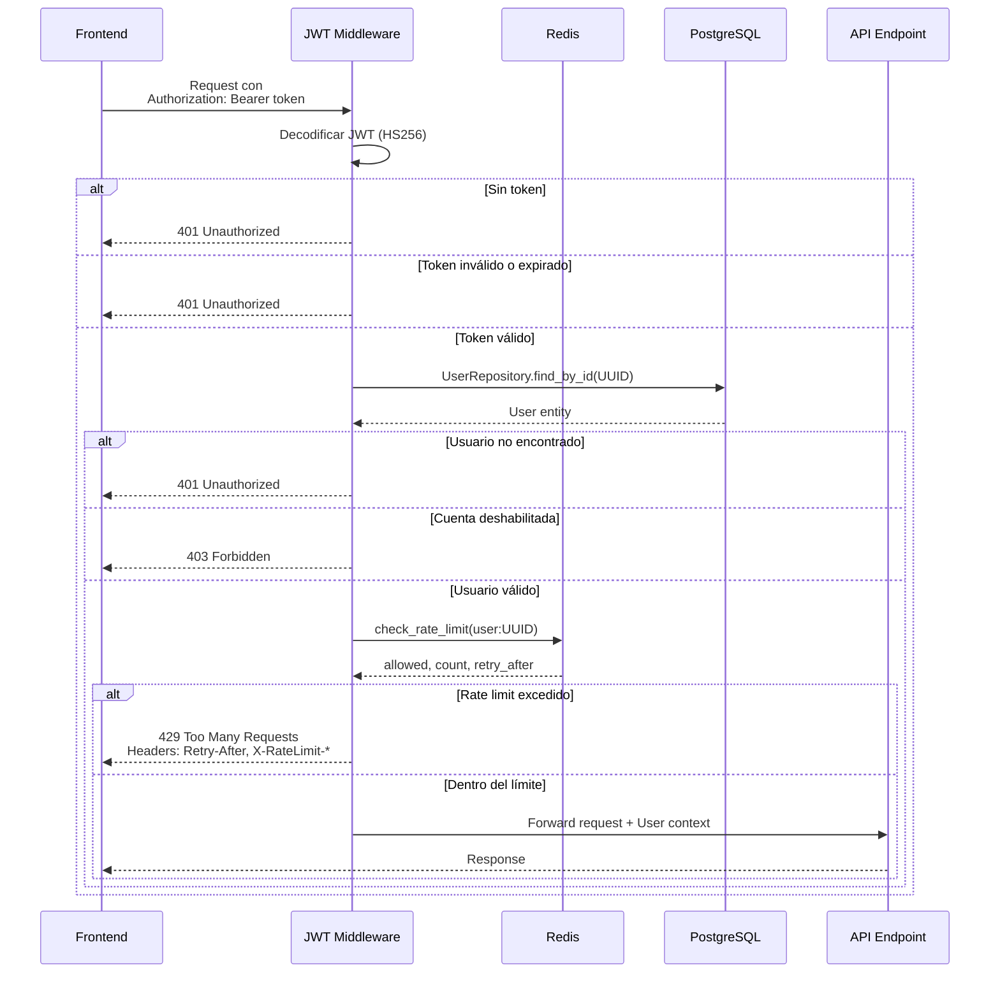
```mermaid
sequenceDiagram
    participant Client as Frontend
    participant Middleware as JWT Middleware
    participant Redis as Redis
    participant DB as PostgreSQL
    participant Endpoint as API Endpoint

    Client->>Middleware: Request con<br/>Authorization: Bearer token

    Middleware->>Middleware: Decodificar JWT (HS256)

    alt Sin token
        Middleware-->>Client: 401 Unauthorized
    else Token inválido o expirado
        Middleware-->>Client: 401 Unauthorized
    else Token válido
        Middleware->>DB: UserRepository.find_by_id(UUID)
        DB-->>Middleware: User entity

        alt Usuario no encontrado
            Middleware-->>Client: 401 Unauthorized
        else Cuenta deshabilitada
            Middleware-->>Client: 403 Forbidden
        else Usuario válido
            Middleware->>Redis: check_rate_limit(user:UUID)
            Redis-->>Middleware: allowed, count, retry_after

            alt Rate limit excedido
                Middleware-->>Client: 429 Too Many Requests<br/>Headers: Retry-After, X-RateLimit-*
            else Dentro del límite
                Middleware->>Endpoint: Forward request + User context
                Endpoint-->>Client: Response
            end
        end
    end
```

### Matriz de Permisos por Rol

| Endpoint | Admin | Loader | Approver |
|----------|:-----:|:------:|:--------:|
| `GET /api/v1/documents` | Si | Si | Si |
| `GET /api/v1/documents/{id}` | Si | Si | Si |
| `POST /api/v1/documents` | Si | Si | No |
| `PUT /api/v1/documents/{id}` | Si | Si | No |
| `PATCH /api/v1/documents/{id}/status` | Si | No | Si |
| `POST /api/v1/documents/batch/process` | Si | Si | No |
| `GET /api/v1/jobs` | Si | Si | Si |
| `GET /api/v1/jobs/{job_id}` | Si | Si | Si |
| `GET /api/v1/admin/users` | Si | No | No |
| `PATCH /api/v1/admin/users/{id}/approve` | Si | No | No |
| `PATCH /api/v1/admin/users/{id}/disable` | Si | No | No |
| `GET /api/v1/admin/logs` | Si | No | No |

---

## Resumen de Decisiones de Arquitectura

### Patrones Utilizados

| Patrón | Aplicación | Beneficio |
|--------|-----------|-----------|
| Clean Architecture | Estructura general del backend | Separación de responsabilidades, testeable |
| Repository Pattern | Acceso a datos (Document, Job, User, Audit) | Abstracción de BD, facilita testing |
| Use Case Pattern | Lógica de negocio en Application Layer | Un caso de uso = una responsabilidad |
| State Machine | Validación de estados de documento | Centraliza reglas de transición |
| Strategy Pattern | Sistema de notificaciones (canales intercambiables) | Extensibilidad sin modificar dispatcher |
| Factory Pattern | Construcción de canales de notificación | Registro centralizado de tipos de canal |
| Dependency Injection | Toda la app (FastAPI Depends) | Bajo acoplamiento, fácil mock |
| Container/Presentational | Componentes React (Pages vs Components) | Separación de lógica y UI |

### Stack Tecnológico

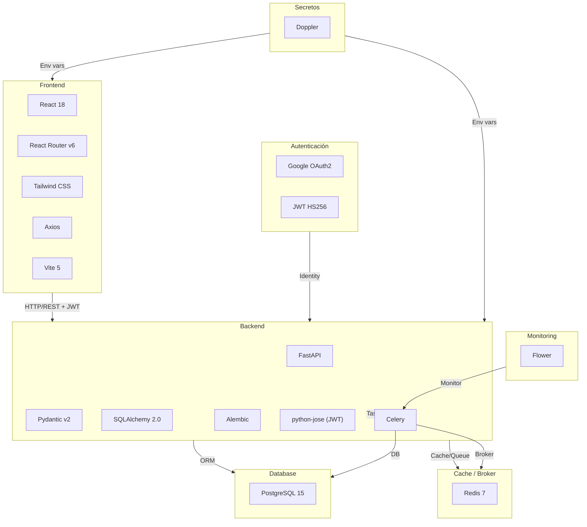
```mermaid
graph TB
    subgraph Frontend
        React["React 18"]
        ReactRouter["React Router v6"]
        Tailwind["Tailwind CSS"]
        Axios["Axios"]
        Vite["Vite 5"]
    end

    subgraph Backend
        FastAPI["FastAPI"]
        Pydantic["Pydantic v2"]
        SQLAlchemy["SQLAlchemy 2.0"]
        Celery["Celery"]
        Alembic["Alembic"]
        PythonJose["python-jose (JWT)"]
    end

    subgraph Database
        PostgreSQL["PostgreSQL 15"]
    end

    subgraph CacheBroker["Cache / Broker"]
        Redis["Redis 7"]
    end

    subgraph Auth["Autenticación"]
        GoogleOAuth2["Google OAuth2"]
        JWTTokens["JWT HS256"]
    end

    subgraph SecretsMgmt["Secretos"]
        Doppler["Doppler"]
    end

    subgraph Monitoring
        Flower["Flower"]
    end

    Frontend -->|"HTTP/REST + JWT"| Backend
    Backend -->|"ORM"| Database
    Backend -->|"Cache/Queue"| CacheBroker
    Backend -->|"Tasks"| Celery
    Celery -->|"Broker"| CacheBroker
    Celery -->|"DB"| Database
    Monitoring -->|"Monitor"| Celery
    Auth -->|"Identity"| Backend
    SecretsMgmt -->|"Env vars"| Backend
    SecretsMgmt -->|"Env vars"| Frontend
```
