# Diseño de Arquitectura - API Documentos Financieros Duppla

## Índice

1. [Diagramas C4](#diagramas-c4)
   - [Nivel 1: Contexto del Sistema](#nivel-1-contexto-del-sistema)
   - [Nivel 2: Contenedores](#nivel-2-contenedores)
   - [Nivel 3: Componentes](#nivel-3-componentes)
2. [Arquitectura de Capas](#arquitectura-de-capas)
3. [Diagramas de Flujo](#diagramas-de-flujo)
4. [State Machine](#state-machine)
5. [Modelo de Datos](#modelo-de-datos)
6. [Seguridad](#seguridad)

---

## Diagramas C4

### Nivel 1: Contexto del Sistema

Este diagrama muestra cómo el sistema interactúa con usuarios y sistemas externos.

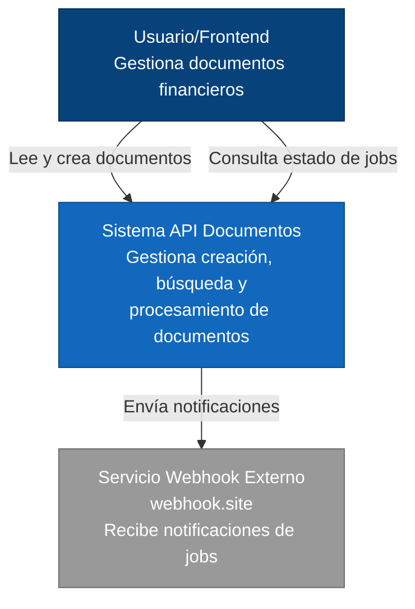
```mermaid
graph TB
    User[Usuario/Frontend<br/>Gestiona documentos financieros]

    System[Sistema API Documentos<br/>Gestiona creación, búsqueda y<br/>procesamiento de documentos]

    WebhookService[Servicio Webhook Externo<br/>webhook.site<br/>Recibe notificaciones de jobs]

    User -->|Lee y crea documentos| System
    User -->|Consulta estado de jobs| System
    System -->|Envía notificaciones| WebhookService

    style System fill:#1168bd,stroke:#0b4884,color:#ffffff
    style User fill:#08427b,stroke:#052e56,color:#ffffff
    style WebhookService fill:#999999,stroke:#6b6b6b,color:#ffffff
```

**Descripción:**
- **Usuario/Frontend**: Interactúa con la API para gestionar documentos financieros
- **Sistema API Documentos**: Proporciona endpoints REST para CRUD, búsqueda con filtros y procesamiento batch asíncrono
- **Servicio Webhook Externo**: Recibe notificaciones cuando se completan trabajos de procesamiento batch

---

### Nivel 2: Contenedores

Este diagrama muestra los contenedores principales del sistema y cómo se comunican.

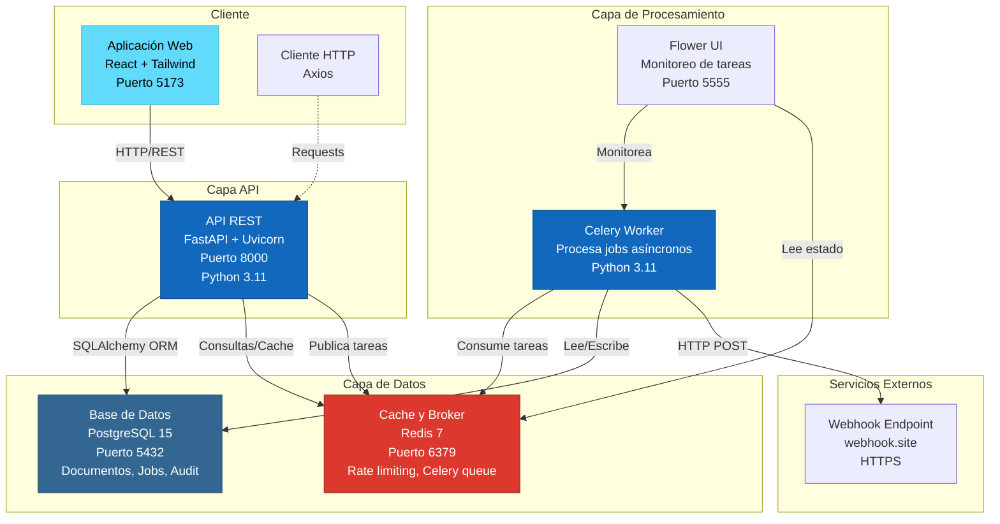
```mermaid
graph TB
    subgraph ClientLayer[Cliente]
        WebApp[Aplicación Web<br/>React + Tailwind<br/>Puerto 5173]
        APIClient[Cliente HTTP<br/>Axios]
    end

    subgraph APILayer[Capa API]
        FastAPI[API REST<br/>FastAPI + Uvicorn<br/>Puerto 8000<br/>Python 3.11]
    end

    subgraph WorkerLayer[Capa de Procesamiento]
        CeleryWorker[Celery Worker<br/>Procesa jobs asíncronos<br/>Python 3.11]
        Flower[Flower UI<br/>Monitoreo de tareas<br/>Puerto 5555]
    end

    subgraph DataLayer[Capa de Datos]
        PostgreSQL[Base de Datos<br/>PostgreSQL 15<br/>Puerto 5432<br/>Documentos, Jobs, Audit]
        Redis[Cache y Broker<br/>Redis 7<br/>Puerto 6379<br/>Rate limiting, Celery queue]
    end

    subgraph ExternalLayer[Servicios Externos]
        WebhookEndpoint[Webhook Endpoint<br/>webhook.site<br/>HTTPS]
    end

    WebApp -->|HTTP/REST| FastAPI
    APIClient -.->|Requests| FastAPI

    FastAPI -->|SQLAlchemy ORM| PostgreSQL
    FastAPI -->|Consultas/Cache| Redis
    FastAPI -->|Publica tareas| Redis

    CeleryWorker -->|Consume tareas| Redis
    CeleryWorker -->|Lee/Escribe| PostgreSQL
    CeleryWorker -->|HTTP POST| WebhookEndpoint

    Flower -->|Monitorea| CeleryWorker
    Flower -->|Lee estado| Redis

    style FastAPI fill:#1168bd,stroke:#0b4884,color:#ffffff
    style CeleryWorker fill:#1168bd,stroke:#0b4884,color:#ffffff
    style PostgreSQL fill:#336791,stroke:#2d5a7b,color:#ffffff
    style Redis fill:#dc382d,stroke:#a82923,color:#ffffff
    style WebApp fill:#61dafb,stroke:#4ab8d4,color:#000000
```

**Tecnologías por Contenedor:**

| Contenedor | Tecnología | Propósito |
|------------|-----------|-----------|
| API REST | FastAPI + Uvicorn | Endpoints HTTP, validación, autenticación |
| Celery Worker | Celery + Python | Procesamiento asíncrono de lotes |
| PostgreSQL | PostgreSQL 15 | Persistencia de documentos y jobs |
| Redis | Redis 7 | Cache, rate limiting y cola de mensajes |
| Flower | Flower | Monitoreo visual de workers |

---

### Nivel 3: Componentes

Este diagrama muestra la arquitectura interna del contenedor API REST usando Clean Architecture.

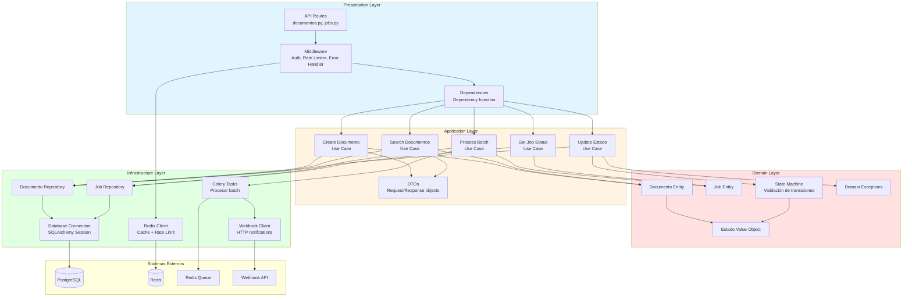
```mermaid
graph TB
    subgraph PresentationLayer[Presentation Layer]
        Routes[API Routes<br/>documentos.py, jobs.py]
        Middleware[Middleware<br/>Auth, Rate Limiter, Error Handler]
        Dependencies[Dependencies<br/>Dependency Injection]
    end

    subgraph ApplicationLayer[Application Layer]
        CreateUC[Create Documento<br/>Use Case]
        SearchUC[Search Documentos<br/>Use Case]
        UpdateUC[Update Estado<br/>Use Case]
        BatchUC[Process Batch<br/>Use Case]
        GetJobUC[Get Job Status<br/>Use Case]
        DTOs[DTOs<br/>Request/Response objects]
    end

    subgraph DomainLayer[Domain Layer]
        DocumentoEntity[Documento Entity]
        JobEntity[Job Entity]
        EstadoVO[Estado Value Object]
        StateMachine[State Machine<br/>Validación de transiciones]
        Exceptions[Domain Exceptions]
    end

    subgraph InfrastructureLayer[Infrastructure Layer]
        DocumentoRepo[Documento Repository]
        JobRepo[Job Repository]
        DatabaseConn[Database Connection<br/>SQLAlchemy Session]
        RedisClient[Redis Client<br/>Cache + Rate Limit]
        CeleryTasks[Celery Tasks<br/>Procesar batch]
        WebhookClient[Webhook Client<br/>HTTP notifications]
    end

    subgraph ExternalSystems[Sistemas Externos]
        DB[(PostgreSQL)]
        Cache[(Redis)]
        QueueBroker[Redis Queue]
        WebhookAPI[Webhook API]
    end

    Routes --> Middleware
    Middleware --> Dependencies
    Dependencies --> CreateUC
    Dependencies --> SearchUC
    Dependencies --> UpdateUC
    Dependencies --> BatchUC
    Dependencies --> GetJobUC

    CreateUC --> DocumentoEntity
    SearchUC --> DocumentoEntity
    UpdateUC --> StateMachine
    BatchUC --> JobEntity
    GetJobUC --> JobEntity

    CreateUC --> DTOs
    SearchUC --> DTOs

    DocumentoEntity --> EstadoVO
    UpdateUC --> Exceptions
    StateMachine --> EstadoVO

    CreateUC --> DocumentoRepo
    SearchUC --> DocumentoRepo
    UpdateUC --> DocumentoRepo
    BatchUC --> JobRepo
    BatchUC --> CeleryTasks
    GetJobUC --> JobRepo

    DocumentoRepo --> DatabaseConn
    JobRepo --> DatabaseConn
    Middleware --> RedisClient

    DatabaseConn --> DB
    RedisClient --> Cache
    CeleryTasks --> QueueBroker
    CeleryTasks --> WebhookClient
    WebhookClient --> WebhookAPI

    style PresentationLayer fill:#e1f5ff
    style ApplicationLayer fill:#fff4e1
    style DomainLayer fill:#ffe1e1
    style InfrastructureLayer fill:#e1ffe1
```

**Responsabilidades por Capa:**

#### 1. Presentation Layer (API)
- **Routes**: Define endpoints HTTP y mapea requests/responses
- **Middleware**: Autenticación, rate limiting, manejo de errores
- **Dependencies**: Inyección de dependencias (repositories, use cases)

#### 2. Application Layer (Casos de Uso)
- **Create Documento**: Valida datos de negocio y crea documento
- **Search Documentos**: Aplica filtros y paginación
- **Update Estado**: Valida transiciones de estado permitidas
- **Process Batch**: Dispara procesamiento asíncrono
- **Get Job Status**: Consulta estado de jobs

#### 3. Domain Layer (Lógica de Negocio)
- **Entities**: Documento, Job (objetos de dominio)
- **Value Objects**: EstadoDocumento (inmutable, con reglas)
- **State Machine**: Valida transiciones borrador → pendiente → aprobado/rechazado
- **Exceptions**: Errores de dominio personalizados

#### 4. Infrastructure Layer (Detalles Técnicos)
- **Repositories**: Abstracción de acceso a datos
- **Database Connection**: Gestión de sesiones SQLAlchemy
- **Redis Client**: Cache y rate limiting
- **Celery Tasks**: Workers para procesamiento asíncrono
- **Webhook Client**: Cliente HTTP para notificaciones

---

## Arquitectura de Capas

### Diagrama de Clean Architecture

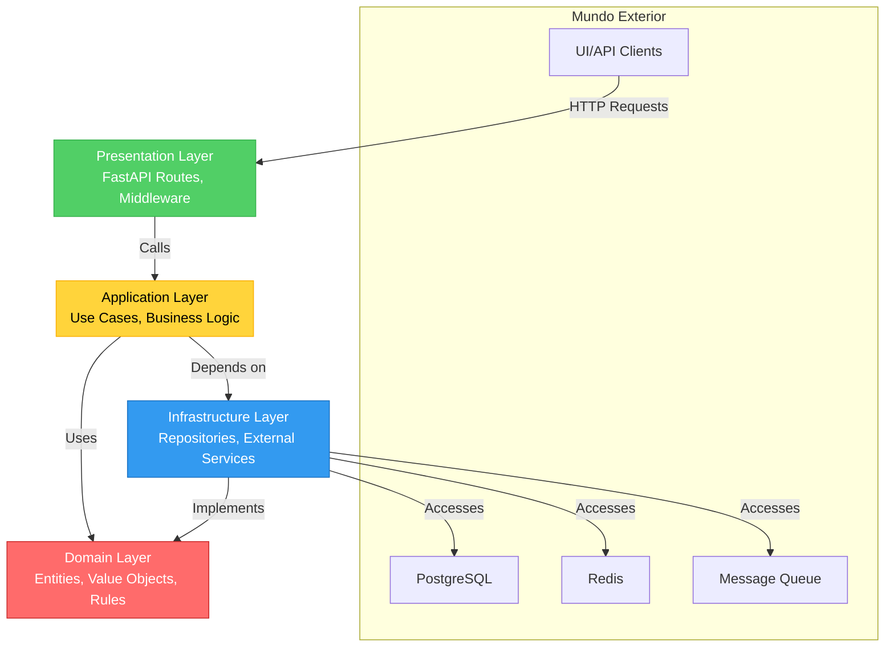
```mermaid
graph TD
    subgraph External[Mundo Exterior]
        UI[UI/API Clients]
        DB[PostgreSQL]
        Cache[Redis]
        Queue[Message Queue]
    end

    subgraph Presentation[Presentation Layer<br/>FastAPI Routes, Middleware]
    end

    subgraph Application[Application Layer<br/>Use Cases, Business Logic]
    end

    subgraph Domain[Domain Layer<br/>Entities, Value Objects, Rules]
    end

    subgraph Infrastructure[Infrastructure Layer<br/>Repositories, External Services]
    end

    UI -->|HTTP Requests| Presentation
    Presentation -->|Calls| Application
    Application -->|Uses| Domain
    Application -->|Depends on| Infrastructure
    Infrastructure -->|Implements| Domain
    Infrastructure -->|Accesses| DB
    Infrastructure -->|Accesses| Cache
    Infrastructure -->|Accesses| Queue

    style Domain fill:#ff6b6b,stroke:#c92a2a,color:#ffffff
    style Application fill:#ffd43b,stroke:#fab005,color:#000000
    style Presentation fill:#51cf66,stroke:#37b24d,color:#ffffff
    style Infrastructure fill:#339af0,stroke:#1971c2,color:#ffffff
```

### Flujo de Dependencias

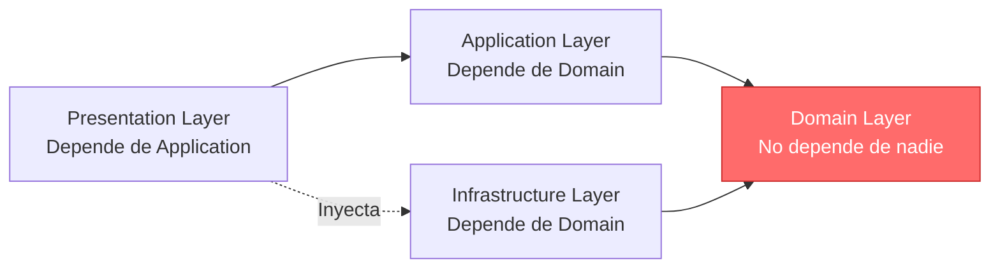
```mermaid
graph LR
    Domain[Domain Layer<br/>No depende de nadie]
    Application[Application Layer<br/>Depende de Domain]
    Infrastructure[Infrastructure Layer<br/>Depende de Domain]
    Presentation[Presentation Layer<br/>Depende de Application]

    Presentation --> Application
    Application --> Domain
    Infrastructure --> Domain
    Presentation -.->|Inyecta| Infrastructure

    style Domain fill:#ff6b6b,stroke:#c92a2a,color:#ffffff
```

**Principio de Inversión de Dependencias:**
- Las capas externas dependen de las internas
- El dominio no conoce detalles de infraestructura
- Los repositories son interfaces en Domain, implementadas en Infrastructure

---

## Diagramas de Flujo

### Flujo 1: Crear Documento

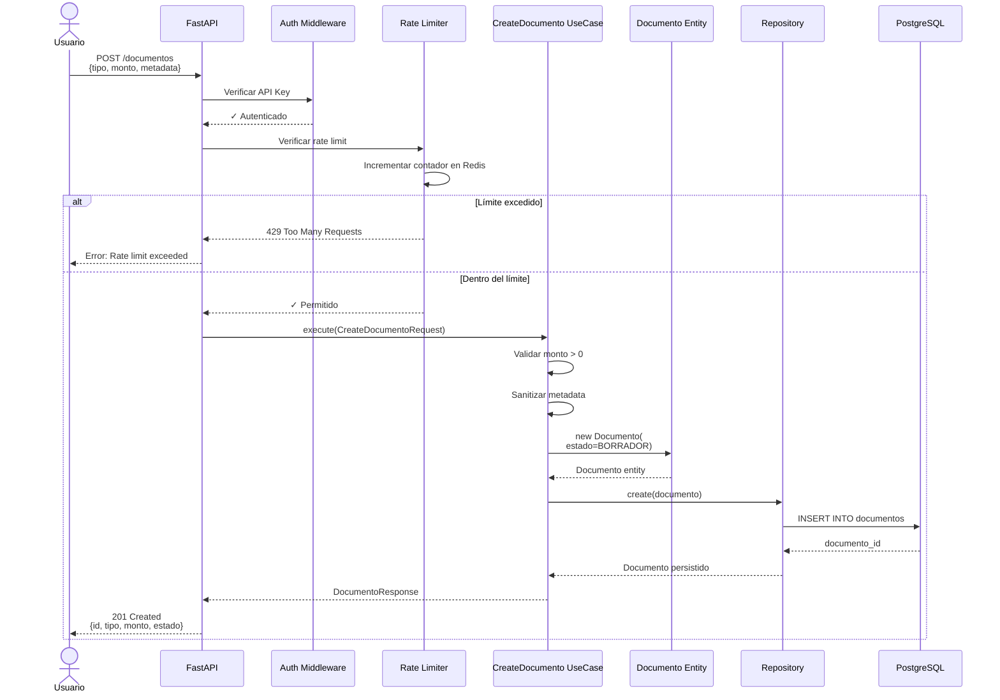
```mermaid
sequenceDiagram
    actor User as Usuario
    participant API as FastAPI
    participant Auth as Auth Middleware
    participant RL as Rate Limiter
    participant UC as CreateDocumento UseCase
    participant Domain as Documento Entity
    participant Repo as Repository
    participant DB as PostgreSQL

    User->>API: POST /documentos<br/>{tipo, monto, metadata}
    API->>Auth: Verificar API Key
    Auth-->>API: ✓ Autenticado

    API->>RL: Verificar rate limit
    RL->>RL: Incrementar contador en Redis
    alt Límite excedido
        RL-->>API: 429 Too Many Requests
        API-->>User: Error: Rate limit exceeded
    else Dentro del límite
        RL-->>API: ✓ Permitido

        API->>UC: execute(CreateDocumentoRequest)
        UC->>UC: Validar monto > 0
        UC->>UC: Sanitizar metadata

        UC->>Domain: new Documento(<br/>estado=BORRADOR)
        Domain-->>UC: Documento entity

        UC->>Repo: create(documento)
        Repo->>DB: INSERT INTO documentos
        DB-->>Repo: documento_id
        Repo-->>UC: Documento persistido

        UC-->>API: DocumentoResponse
        API-->>User: 201 Created<br/>{id, tipo, monto, estado}
    end
```

---

### Flujo 2: Actualizar Estado de Documento

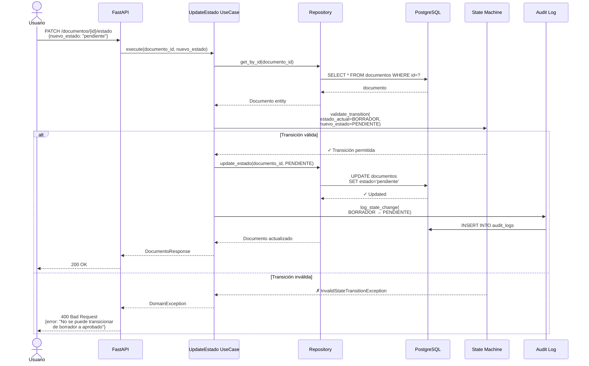
```mermaid
sequenceDiagram
    actor User as Usuario
    participant API as FastAPI
    participant UC as UpdateEstado UseCase
    participant Repo as Repository
    participant DB as PostgreSQL
    participant SM as State Machine
    participant Audit as Audit Log

    User->>API: PATCH /documentos/{id}/estado<br/>{nuevo_estado: "pendiente"}

    API->>UC: execute(documento_id, nuevo_estado)
    UC->>Repo: get_by_id(documento_id)
    Repo->>DB: SELECT * FROM documentos WHERE id=?
    DB-->>Repo: documento
    Repo-->>UC: Documento entity

    UC->>SM: validate_transition(<br/>estado_actual=BORRADOR,<br/>nuevo_estado=PENDIENTE)

    alt Transición válida
        SM-->>UC: ✓ Transición permitida

        UC->>Repo: update_estado(documento_id, PENDIENTE)
        Repo->>DB: UPDATE documentos<br/>SET estado='pendiente'
        DB-->>Repo: ✓ Updated

        UC->>Audit: log_state_change(<br/>BORRADOR → PENDIENTE)
        Audit->>DB: INSERT INTO audit_logs

        Repo-->>UC: Documento actualizado
        UC-->>API: DocumentoResponse
        API-->>User: 200 OK
    else Transición inválida
        SM-->>UC: ✗ InvalidStateTransitionException
        UC-->>API: DomainException
        API-->>User: 400 Bad Request<br/>{error: "No se puede transicionar<br/>de borrador a aprobado"}
    end
```

---

### Flujo 3: Procesamiento Batch Asíncrono

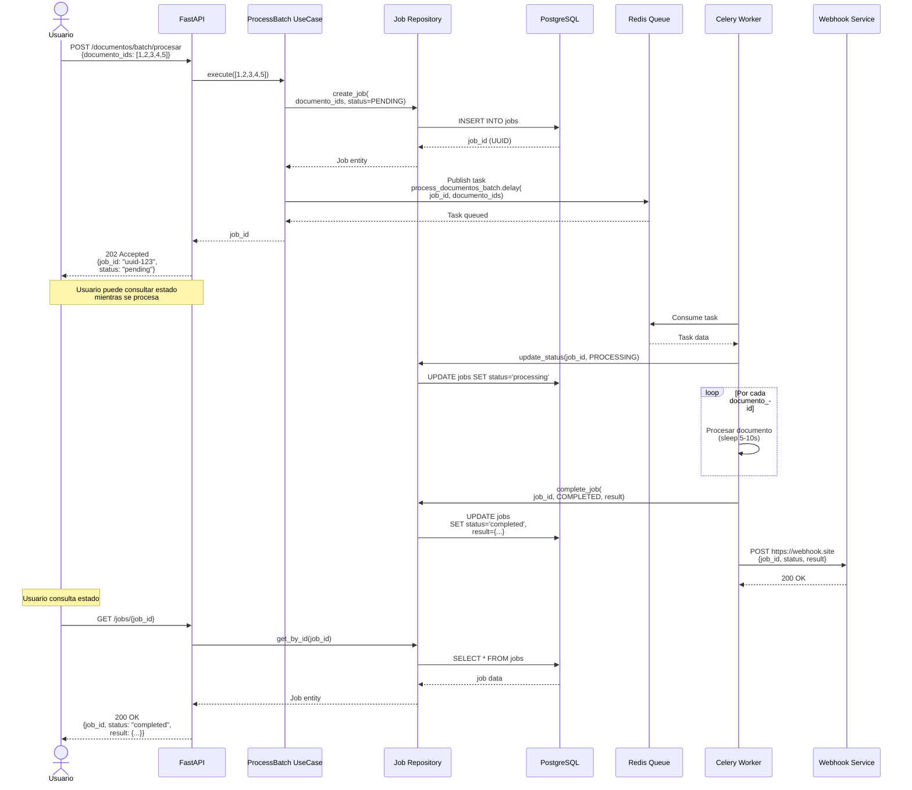
```mermaid
sequenceDiagram
    actor User as Usuario
    participant API as FastAPI
    participant UC as ProcessBatch UseCase
    participant JobRepo as Job Repository
    participant DB as PostgreSQL
    participant Redis as Redis Queue
    participant Worker as Celery Worker
    participant Webhook as Webhook Service

    User->>API: POST /documentos/batch/procesar<br/>{documento_ids: [1,2,3,4,5]}

    API->>UC: execute([1,2,3,4,5])

    UC->>JobRepo: create_job(<br/>documento_ids, status=PENDING)
    JobRepo->>DB: INSERT INTO jobs
    DB-->>JobRepo: job_id (UUID)
    JobRepo-->>UC: Job entity

    UC->>Redis: Publish task<br/>process_documentos_batch.delay(<br/>job_id, documento_ids)
    Redis-->>UC: Task queued

    UC-->>API: job_id
    API-->>User: 202 Accepted<br/>{job_id: "uuid-123",<br/>status: "pending"}

    Note over User,API: Usuario puede consultar estado<br/>mientras se procesa

    Worker->>Redis: Consume task
    Redis-->>Worker: Task data

    Worker->>JobRepo: update_status(job_id, PROCESSING)
    JobRepo->>DB: UPDATE jobs SET status='processing'

    loop Por cada documento_id
        Worker->>Worker: Procesar documento<br/>(sleep 5-10s)
    end

    Worker->>JobRepo: complete_job(<br/>job_id, COMPLETED, result)
    JobRepo->>DB: UPDATE jobs<br/>SET status='completed',<br/>result={...}

    Worker->>Webhook: POST https://webhook.site<br/>{job_id, status, result}
    Webhook-->>Worker: 200 OK

    Note over User: Usuario consulta estado
    User->>API: GET /jobs/{job_id}
    API->>JobRepo: get_by_id(job_id)
    JobRepo->>DB: SELECT * FROM jobs
    DB-->>JobRepo: job data
    JobRepo-->>API: Job entity
    API-->>User: 200 OK<br/>{job_id, status: "completed",<br/>result: {...}}
```

---

### Flujo 4: Búsqueda con Filtros y Paginación

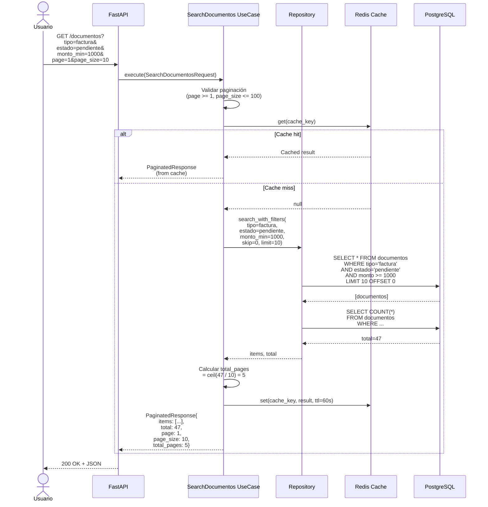
```mermaid
sequenceDiagram
    actor User as Usuario
    participant API as FastAPI
    participant UC as SearchDocumentos UseCase
    participant Repo as Repository
    participant Cache as Redis Cache
    participant DB as PostgreSQL

    User->>API: GET /documentos?<br/>tipo=factura&<br/>estado=pendiente&<br/>monto_min=1000&<br/>page=1&page_size=10

    API->>UC: execute(SearchDocumentosRequest)

    UC->>UC: Validar paginación<br/>(page >= 1, page_size <= 100)

    UC->>Cache: get(cache_key)

    alt Cache hit
        Cache-->>UC: Cached result
        UC-->>API: PaginatedResponse<br/>(from cache)
    else Cache miss
        Cache-->>UC: null

        UC->>Repo: search_with_filters(<br/>tipo=factura,<br/>estado=pendiente,<br/>monto_min=1000,<br/>skip=0, limit=10)

        Repo->>DB: SELECT * FROM documentos<br/>WHERE tipo='factura'<br/>AND estado='pendiente'<br/>AND monto >= 1000<br/>LIMIT 10 OFFSET 0
        DB-->>Repo: [documentos]

        Repo->>DB: SELECT COUNT(*)<br/>FROM documentos<br/>WHERE ...
        DB-->>Repo: total=47

        Repo-->>UC: items, total

        UC->>UC: Calcular total_pages<br/>= ceil(47 / 10) = 5

        UC->>Cache: set(cache_key, result, ttl=60s)

        UC-->>API: PaginatedResponse{<br/>items: [...],<br/>total: 47,<br/>page: 1,<br/>page_size: 10,<br/>total_pages: 5}
    end

    API-->>User: 200 OK + JSON
```

---

### Flujo 5: Rate Limiting

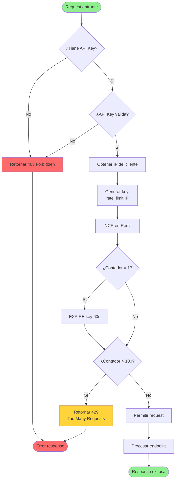
```mermaid
flowchart TD
    Start([Request entrante]) --> CheckKey{¿Tiene API Key?}

    CheckKey -->|No| Return403[Retornar 403 Forbidden]
    CheckKey -->|Sí| ValidateKey{¿API Key válida?}

    ValidateKey -->|No| Return403
    ValidateKey -->|Sí| GetIP[Obtener IP del cliente]

    GetIP --> RedisKey[Generar key:<br/>rate_limit:IP]
    RedisKey --> Increment[INCR en Redis]

    Increment --> CheckFirst{¿Contador = 1?}
    CheckFirst -->|Sí| SetExpire[EXPIRE key 60s]
    CheckFirst -->|No| CheckLimit

    SetExpire --> CheckLimit{¿Contador > 100?}

    CheckLimit -->|Sí| Return429[Retornar 429<br/>Too Many Requests]
    CheckLimit -->|No| AllowRequest[Permitir request]

    AllowRequest --> ProcessRequest[Procesar endpoint]
    ProcessRequest --> End([Response exitosa])

    Return403 --> EndError([Error response])
    Return429 --> EndError

    style Start fill:#90ee90
    style End fill:#90ee90
    style EndError fill:#ff6b6b
    style Return429 fill:#ffd43b
    style Return403 fill:#ff6b6b
```

---

## State Machine

### Diagrama de Estados del Documento

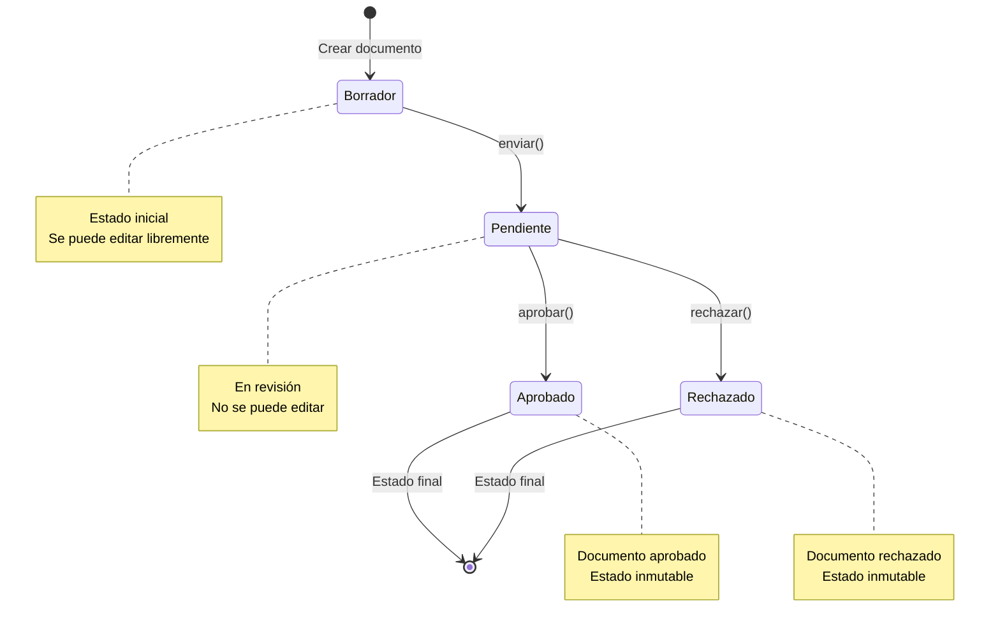
```mermaid
stateDiagram-v2
    [*] --> Borrador: Crear documento

    Borrador --> Pendiente: enviar()

    Pendiente --> Aprobado: aprobar()
    Pendiente --> Rechazado: rechazar()

    Aprobado --> [*]: Estado final
    Rechazado --> [*]: Estado final

    note right of Borrador
        Estado inicial
        Se puede editar libremente
    end note

    note right of Pendiente
        En revisión
        No se puede editar
    end note

    note right of Aprobado
        Documento aprobado
        Estado inmutable
    end note

    note right of Rechazado
        Documento rechazado
        Estado inmutable
    end note
```

### Matriz de Transiciones Válidas

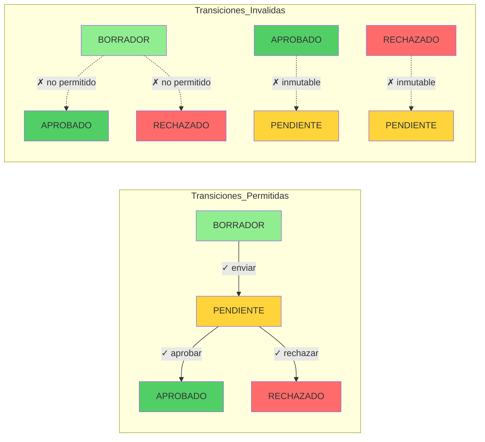
```mermaid
graph LR
    subgraph Transiciones_Permitidas
        B[BORRADOR] -->|✓ enviar| P[PENDIENTE]
        P -->|✓ aprobar| A[APROBADO]
        P -->|✓ rechazar| R[RECHAZADO]
    end

    subgraph Transiciones_Invalidas
        B2[BORRADOR] -.->|✗ no permitido| A2[APROBADO]
        B2 -.->|✗ no permitido| R2[RECHAZADO]
        A3[APROBADO] -.->|✗ inmutable| P2[PENDIENTE]
        R3[RECHAZADO] -.->|✗ inmutable| P3[PENDIENTE]
    end

    style B fill:#90ee90
    style P fill:#ffd43b
    style A fill:#51cf66
    style R fill:#ff6b6b
    style B2 fill:#90ee90
    style A2 fill:#51cf66
    style R2 fill:#ff6b6b
    style A3 fill:#51cf66
    style P2 fill:#ffd43b
    style R3 fill:#ff6b6b
    style P3 fill:#ffd43b
```

---

## Modelo de Datos

### Diagrama Entidad-Relación

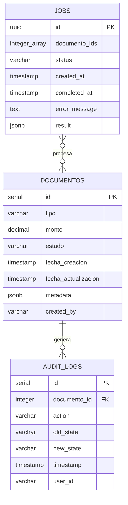
```mermaid
erDiagram
    DOCUMENTOS ||--o{ AUDIT_LOGS : "genera"
    JOBS }o--o{ DOCUMENTOS : "procesa"

    DOCUMENTOS {
        serial id PK
        varchar tipo
        decimal monto
        varchar estado
        timestamp fecha_creacion
        timestamp fecha_actualizacion
        jsonb metadata
        varchar created_by
    }

    JOBS {
        uuid id PK
        integer_array documento_ids
        varchar status
        timestamp created_at
        timestamp completed_at
        text error_message
        jsonb result
    }

    AUDIT_LOGS {
        serial id PK
        integer documento_id FK
        varchar action
        varchar old_state
        varchar new_state
        timestamp timestamp
        varchar user_id
    }
```

### Índices de Base de Datos

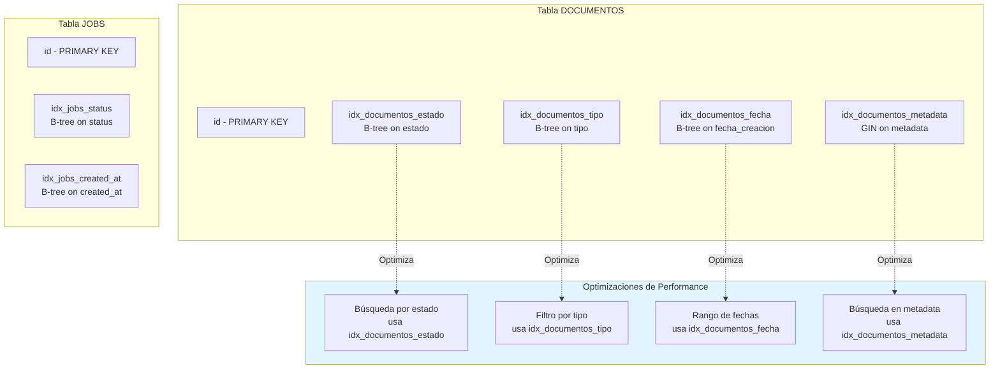
```mermaid
graph TB
    subgraph DocumentosTable[Tabla DOCUMENTOS]
        PK[id - PRIMARY KEY]
        IdxEstado[idx_documentos_estado<br/>B-tree on estado]
        IdxTipo[idx_documentos_tipo<br/>B-tree on tipo]
        IdxFecha[idx_documentos_fecha<br/>B-tree on fecha_creacion]
        IdxMetadata[idx_documentos_metadata<br/>GIN on metadata]
    end

    subgraph JobsTable[Tabla JOBS]
        PKJob[id - PRIMARY KEY]
        IdxStatus[idx_jobs_status<br/>B-tree on status]
        IdxCreated[idx_jobs_created_at<br/>B-tree on created_at]
    end

    subgraph Performance[Optimizaciones de Performance]
        Q1[Búsqueda por estado<br/>usa idx_documentos_estado]
        Q2[Filtro por tipo<br/>usa idx_documentos_tipo]
        Q3[Rango de fechas<br/>usa idx_documentos_fecha]
        Q4[Búsqueda en metadata<br/>usa idx_documentos_metadata]
    end

    IdxEstado -.->|Optimiza| Q1
    IdxTipo -.->|Optimiza| Q2
    IdxFecha -.->|Optimiza| Q3
    IdxMetadata -.->|Optimiza| Q4

    style Performance fill:#e1f5ff
```

---

## Seguridad

### Capas de Seguridad

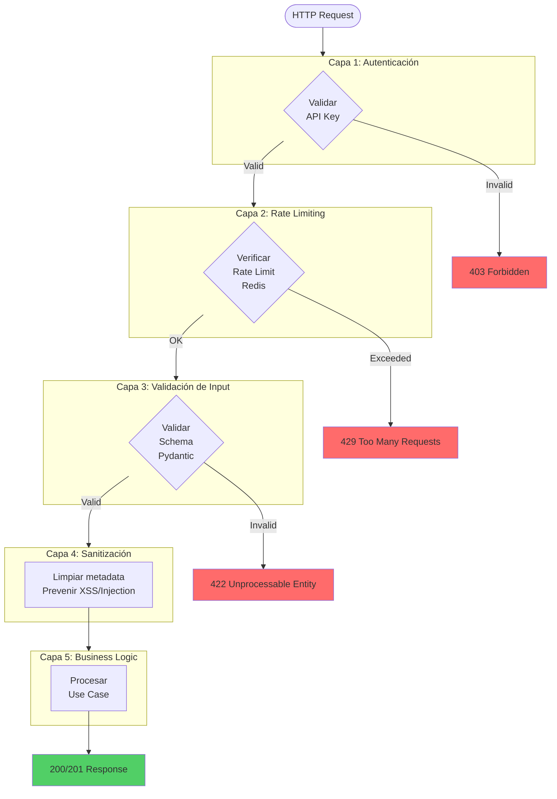
```mermaid
flowchart TB
    Request([HTTP Request]) --> Layer1

    subgraph Layer1[Capa 1: Autenticación]
        CheckAPIKey{Validar<br/>API Key}
    end

    CheckAPIKey -->|Invalid| Reject1[403 Forbidden]
    CheckAPIKey -->|Valid| Layer2

    subgraph Layer2[Capa 2: Rate Limiting]
        CheckRate{Verificar<br/>Rate Limit<br/>Redis}
    end

    CheckRate -->|Exceeded| Reject2[429 Too Many Requests]
    CheckRate -->|OK| Layer3

    subgraph Layer3[Capa 3: Validación de Input]
        ValidateInput{Validar<br/>Schema<br/>Pydantic}
    end

    ValidateInput -->|Invalid| Reject3[422 Unprocessable Entity]
    ValidateInput -->|Valid| Layer4

    subgraph Layer4[Capa 4: Sanitización]
        Sanitize[Limpiar metadata<br/>Prevenir XSS/Injection]
    end

    Sanitize --> Layer5

    subgraph Layer5[Capa 5: Business Logic]
        ProcessRequest[Procesar<br/>Use Case]
    end

    ProcessRequest --> Success[200/201 Response]

    style Reject1 fill:#ff6b6b
    style Reject2 fill:#ff6b6b
    style Reject3 fill:#ff6b6b
    style Success fill:#51cf66
```

### Flujo de Autenticación con API Key

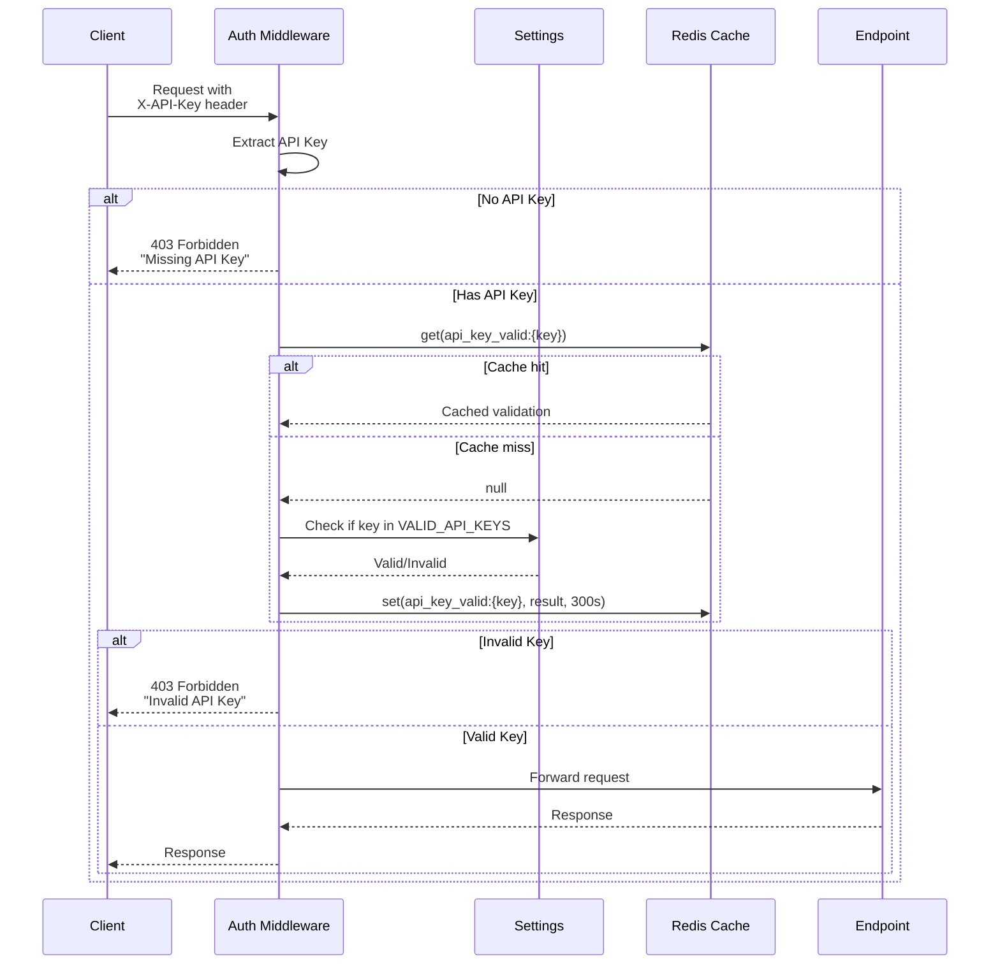
```mermaid
sequenceDiagram
    participant Client
    participant Middleware as Auth Middleware
    participant Config as Settings
    participant Redis as Redis Cache
    participant Endpoint

    Client->>Middleware: Request with<br/>X-API-Key header

    Middleware->>Middleware: Extract API Key

    alt No API Key
        Middleware-->>Client: 403 Forbidden<br/>"Missing API Key"
    else Has API Key
        Middleware->>Redis: get(api_key_valid:{key})

        alt Cache hit
            Redis-->>Middleware: Cached validation
        else Cache miss
            Redis-->>Middleware: null
            Middleware->>Config: Check if key in VALID_API_KEYS
            Config-->>Middleware: Valid/Invalid
            Middleware->>Redis: set(api_key_valid:{key}, result, 300s)
        end

        alt Invalid Key
            Middleware-->>Client: 403 Forbidden<br/>"Invalid API Key"
        else Valid Key
            Middleware->>Endpoint: Forward request
            Endpoint-->>Middleware: Response
            Middleware-->>Client: Response
        end
    end
```

---

## Resumen de Decisiones de Arquitectura

### Patrones Utilizados

| Patrón | Aplicación | Beneficio |
|--------|-----------|-----------|
| Clean Architecture | Estructura general | Separación de responsabilidades, testeable |
| Repository Pattern | Acceso a datos | Abstracción de BD, facilita testing |
| Use Case Pattern | Lógica de negocio | Un caso de uso = una responsabilidad |
| State Machine | Validación de estados | Centraliza reglas de transición |
| Dependency Injection | Toda la app | Bajo acoplamiento, fácil mock |
| CQRS Light | Lectura vs escritura | Optimización de queries de búsqueda |

### Stack Tecnológico

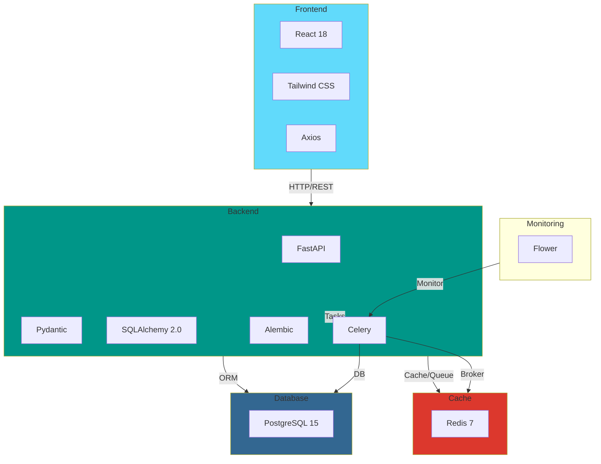
```mermaid
graph TB
    subgraph Frontend
        React[React 18]
        Tailwind[Tailwind CSS]
        Axios[Axios]
    end

    subgraph Backend
        FastAPI[FastAPI]
        Pydantic[Pydantic]
        SQLAlchemy[SQLAlchemy 2.0]
        Celery[Celery]
        Alembic[Alembic]
    end

    subgraph Database
        PostgreSQL[PostgreSQL 15]
    end

    subgraph Cache
        Redis[Redis 7]
    end

    subgraph Monitoring
        Flower[Flower]
    end

    Frontend -->|HTTP/REST| Backend
    Backend -->|ORM| Database
    Backend -->|Cache/Queue| Cache
    Backend -->|Tasks| Celery
    Celery -->|Broker| Cache
    Celery -->|DB| Database
    Monitoring -->|Monitor| Celery

    style Frontend fill:#61dafb
    style Backend fill:#009688
    style Database fill:#336791
    style Cache fill:#dc382d
```

### Métricas de Calidad

- **Cobertura de Tests**: Mínimo 80%
- **Separación de Capas**: 4 capas bien definidas
- **Principios SOLID**: Aplicados en toda la arquitectura
- **Performance**:
  - API: < 100ms (p95)
  - Batch Processing: 5-10s por documento
  - Rate Limit: 100 req/min por IP
- **Seguridad**: API Key + Rate Limiting + Input Sanitization

---

## Próximos Pasos de Implementación

1. ✅ Configurar estructura de directorios
2. ✅ Crear modelos de dominio (Entities, Value Objects)
3. ✅ Implementar State Machine
4. ✅ Configurar Alembic y crear migraciones
5. ✅ Implementar repositories
6. ✅ Crear use cases
7. ✅ Configurar Celery y tareas
8. ✅ Implementar endpoints API
9. ✅ Agregar middleware de seguridad
10. ✅ Escribir tests
11. ✅ Documentar en README
